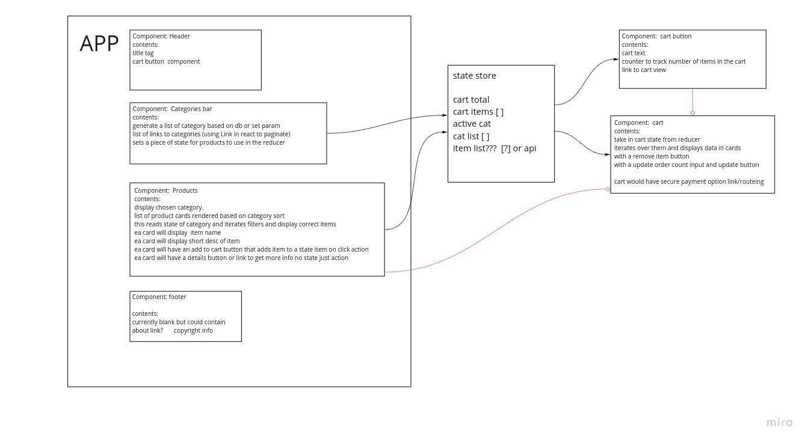

# LAB - Class 36

## Project: storefront

## Authors: Matt Ravenmoore & Andre Olivier Martin

### Links and Resources

- [ci/cd](https://github.com/ravenmoore-401-JS/storefront/actions/new) (GitHub Actions)

- [front-end application](https://laughing-golick-d90a1c.netlify.app) (when applicable)

### Setup

#### How to initialize/run your application (where applicable)

- e.g. `npm start`

#### How to use your library (where applicable)

#### Tests

- How do you run tests?
- Any tests of note?
- Describe any tests that you did not complete, skipped, etc

#### UML

